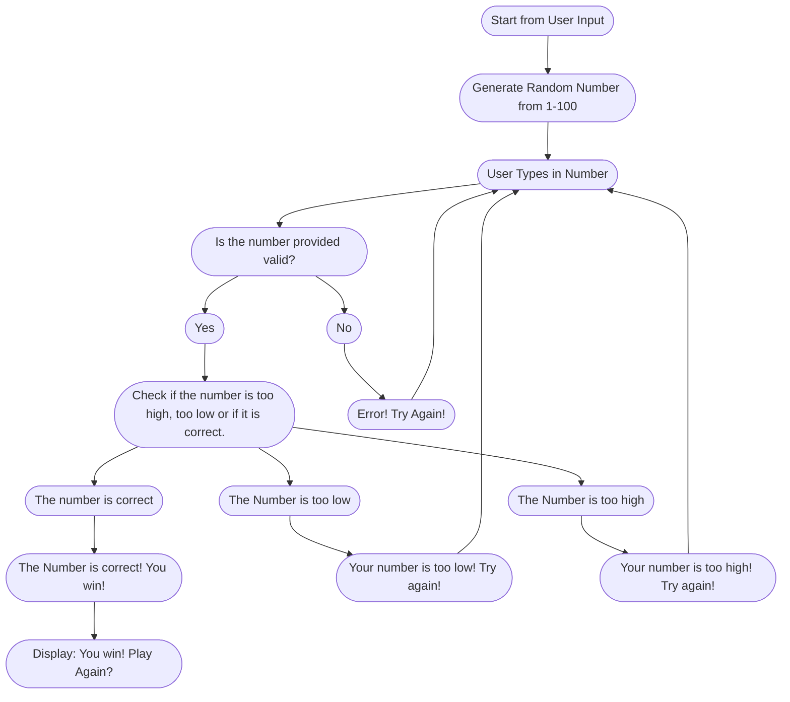

## Mermaid Diagram Explained
+ The game starts with the user inputting start (most likely with a click.)
+ The game randomly generates a number from 1-100, this number is hidden from the user
+ The user then types in a number from 1-100
+ This number must be valid, if not an error message is given and the user is prompted to retype their number
+ Once a valid number is given, the game then checks if the number is too low, too high or if it is correct
+ If the number is too low or too high, the game provides a message saying so. The user then must retype a number.
+ Once the correct number is given, the user wins the game! They are then prompted to play again!
